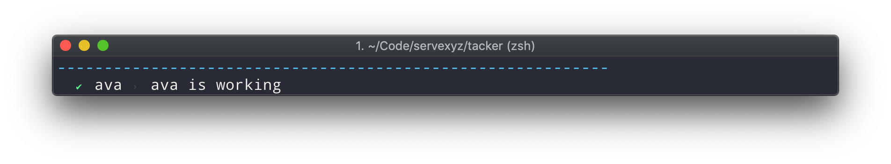
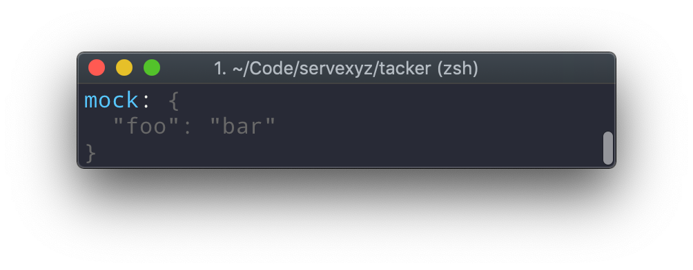
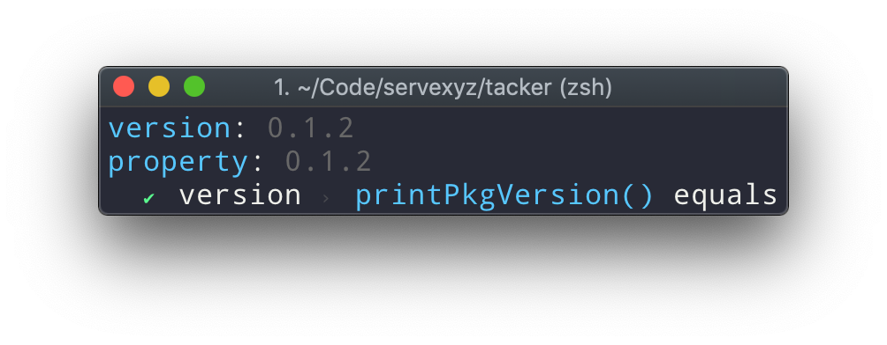

> Logger helpers for your debugging journey


## FAQ

<details><summary>Name</summary>
Portmaneau of "tack" and "logger"

In a sailing context, tack means "change course by turning a boat's head into and through the wind"

</details>

<details><summary>Why</summary>There's reasons to use more sophisticated tooling (stack traces, Chrome dev tools, etc). However, when you're getting up-and-running with a project, it's extremely helpful to be able to log values. The issue is before long, your terminal is contaminated with a slew of logs. Tacker exists to solve this</details>
<details><summary>How</summary>
<ul>
<li> Make logs prettier (current)</li>
<li> Only log things in certain circumstances (future)</li>
</ul>
</details>

## Getting Started

#### Install

```sh
npm install tacker -S
```

#### Add to source

```js
import { printLine, printMirror, printPkgVersion, printPkgProp } from "tacker";
```

## API

<details><summary><code>printLine(szColor || oColor)</code> - Sync </summary>

<h4>Where</h4>

<ul>
<li><em>szColor</em> is a string. Color options can be found on <a href="https://www.npmjs.com/package/chalk" >chalk's readme</a> or in source here</li>
<li><em>oColor</em> is an object comprised of properties so you can mnaually configure the line 
<ul>
<li><code>color</code>: the color of the line; default is <b>blue</b></li>
<li><code>character</code>: the character which will make up the line; default is <b>-</b></li>
<li><code>length</code>: represents the number of characters to repeat; default is <b>59</b></li>
<li><code>quantity</code> represents the number of lines to print; default is <b>1</b></li>
</ul>
</li>
</ul>

<h4>Examples</h4>
<ul>
<li> <code>printLine("blue")</code></li>

<h4>Output</h4>


<hr />
</details>

<details><summary><code>printMirror({ mVariable }, szKeyColor, szValueColor)</code> - Sync</summary>

This will print the variable's name and the variable's value (regardless of variable type).

<h4>Where</h4>
<ul>
<li><em>mVariable</em> is an object or a variable you would like to print. If it's an object or an array, it will pretty-print using JSON.stringify.</li>
<li><em>szVariableKeyColor</em> is a string of the variable's key.  </li>
<li><em>szVariableValueColor</em> is an object or a variable</li>
</ul>

<h4>Example</h4>
<code>
  const mock = {
    foo: "bar"
  };
  printMirror({mock}, "blue", "grey")
</code>

<h4>Output</h4>


<hr />
</details>

<details><summary><code>printPkgVersion(mPkgSource)</code> - Async</summary>
<hr />

This will print the version of the specified package.

<h4>Where</h4>
<ul>
<li><em>mPkgSource</em> allows you to specify which package to read from.

<ul>
<li> <code>undefined</code> </li>
<li> <code>string</code></li>
<li> <code>object</code></li>
</ul>
</li>
</ul>

<h4>Example</h4>
<ul>
<li><code>await printPkgVersion()</code></li>
<li><code>await printPkgVersion("/path")</code></li>
<li><code>await printPkgVersion("/path/package.json")</code></li>
<li><code>await printPkgVersion({ name: "tacker", version: "x.y.z", ...})</code></li>
</ul>

<h4>Output</h4>


<hr />
</details>

<details><summary><code>printPkgProp(szProperty, mPkgSource)</code> - Async</summary>

This will print any property from the specified package.

<h4>Where</h4>
<ul>
<li><em>szProperty</em></li> allows you to specify the package property.
<li><em>mPkgSource</em> allows you to specify which package to read from.

<ul>
<li> <code>undefined</code> </li>
<li> <code>string</code></li>
<li> <code>object</code></li>
</ul>
</li>
</ul>

<h4>Example</h4>
<ul>
<li><code>await printPkgProp("version")</code> </li> 
<li><code>await printPkgProp("version", "/path")</code></li>
<li><code>await printPkgProp("version", "/path/package.json")</code></li>
<li><code>await printPkgProp("version", { name: "tacker", version: "x.y.z", ...})</code></li>
</ul>

<h4>Output</h4>


<hr />
</details>
